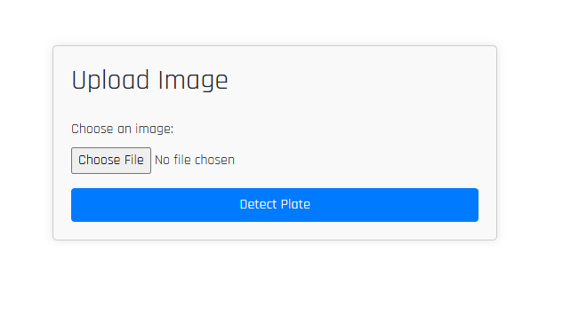
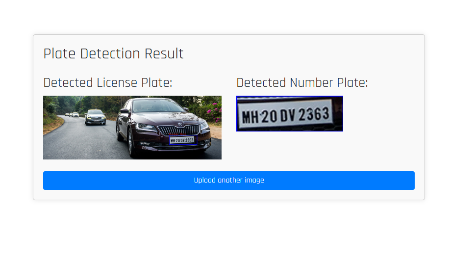

# Number Plate Detection using Django

## Overview

This project implements a number plate detection system using Django, aimed at identifying and highlighting license plates in images. It utilizes OpenCV for image processing and Django for web framework integration, providing a user-friendly interface for uploading images and displaying detection results.

## Features

- **License Plate Detection**: Utilizes Haar Cascade classifier to detect license plates in images.
- **Web Interface**: Built with Django framework, allowing users to upload images and view detection results.
- **Interactive Display**: Displays detected license plates with bounding boxes and provides an option to download the cropped number plate images.

## Tools and Technologies Used

- **Python**: Programming language used for backend processing.
- **Django**: Web framework for building the application's frontend and backend.
- **OpenCV**: Image processing library for detecting license plates.
- **Bootstrap**: Frontend framework for styling the user interface.
- **HTML/CSS**: Used for structuring and styling web pages.
